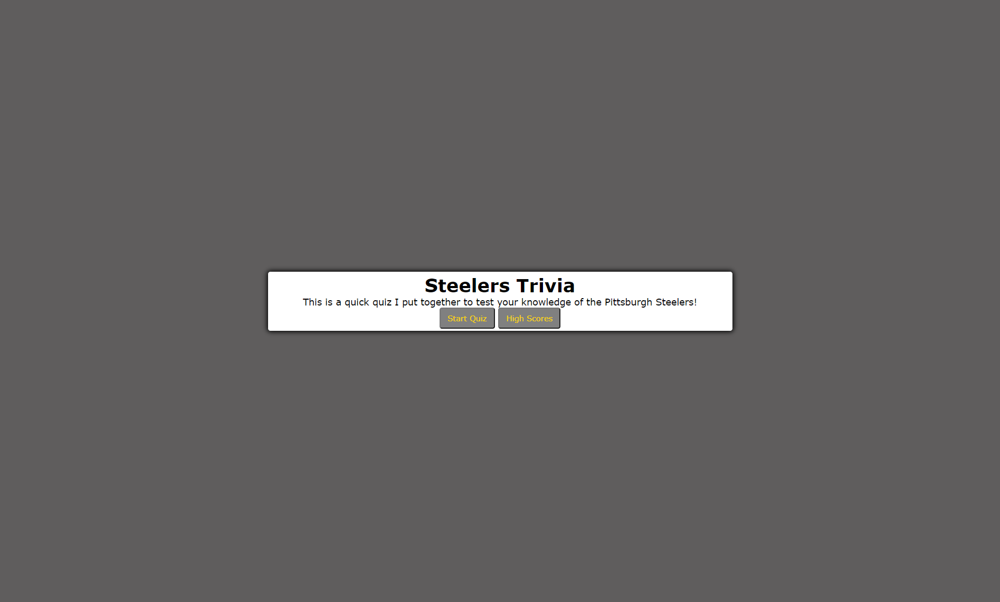

# coding-quiz

## Table of Contents
1. [Description](#description)
2. [Visuals](#visuals)
3. [Links](#links)
4. [Usage](#usage)

### Description  
In this project, we were tasked with:  

- Creating a quiz appication
- Having multiple questions that are dynammically added to the application after a previous question is answered
- Creating a high score page. 
 

After working on these initial tasks. I worked on hitting all the points outlined in the grading criteria. I created a new repository on GitHub titled seo-refactor-project and deployed my changes to the site using the git add, git commit, and git push commands.  

I deployed the site to a live URL and submitted that link along with my GitHub URL. I also ensured there were no load errors and made sure my GitHub repository contained the application code. As well as, ensured the application resemebled the mock-up provided in the homework instructions.  

Lastly, I gave the repository a unique name, ensuring it followed best practices for file structure and naming conventions, as well as, following best practices for class/id naming conventions, indentation, and quality comments. I made sure the repository contained multiple descriptive commit messages and a quality README file with a description, screenshot, and a link to the deployed application. 

### Visuals

  

### Links

[Link to application](https://bigzeus2005.github.io/coding-quiz/)  
[Link to GitHub](https://github.com/bigzeus2005/coding-quiz)

### Usage

This project was used to help us become more familiar with javascript and implementing loops and functions within. 